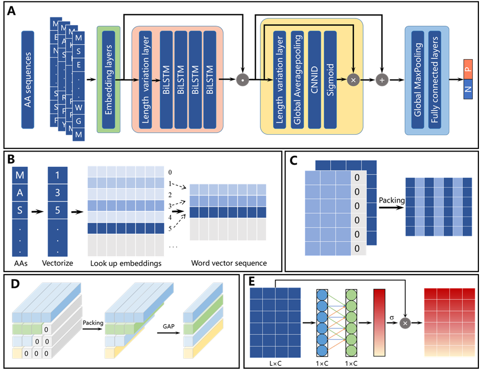
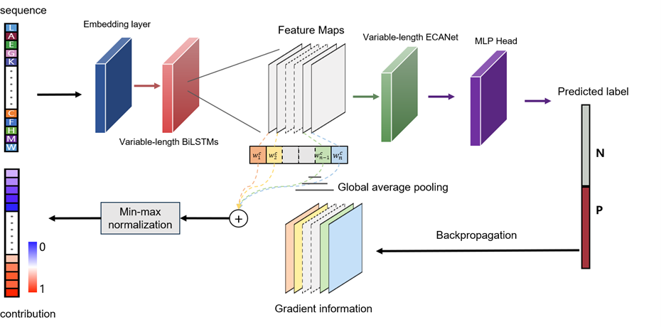

# LRECA

The source codes and a demo are provided to evaluate our LRECA model's ability to discern the phase-separation potential of proteins directly from amino acid (AA) sequences. This demo further scrutinizes the model's explainability by interpreting its predictions, aiming to ascertain the impact of individual amino acids and their sequential patterns on biomolecular condensation regulation. The accompanying code is linked to the paper titled "Discovery of phase separation protein with single amino acid attributions by unbiased deep-learning".

The source codes can be used to train and test the model with 10-fold cross validation on all datasets. However, it will take a lot of time to train the model if you do not have a good GPU. We also provide a demo that includes the trained models and corresponding testing data. The demo can run in a normal computer and will finish in about six minutes.

## Requirement

This code was implemented using the Pytorch framework (version 2.1.1). More details have been described in the file “requirements.txt”.

## Files

Sources codes included three folders, the /RCNN_model, the /Data, and the /RCNN_ECA_saliency. All codes of the demo are included in the fold /Demo.

The folder /RCNN_model contains four files, RCNN_ECA_3_LLPS.py, RCNN_ECA_3_R.py, RCNN_ECA_3_high.py, and RCNN_ECA_3_madata.py, which contain the code for training and testing the model using 10-fold cross validation on the datasets of LLPS and PDB, phaspDB_reviewed and PDB, phaspDB_highthroughput and PDB, and inhouse-dataset and PDB, respectively.

The folder /Data contains the negative data from the PDB database and the positive data from public databases and the in-house dataset (mydata).

The folder /RCNN_ECA_saliency contains the files for computing the contribution of each AA and AA segment. Specifically, /RCNN_ECA_saliency /saliency_function /method /RCNN_ECA_saliency_gradCAM.py contain the code for obtained the contribution of each AA. /RCNN_ECA_saliency /saliency_function /RCNN_ECA_save_model contain the well trained model and corresponding parameters. The folder /RCNN_ECA_saliency /LCRs_process contain the code for identifying the main contributing AA segments in a protein for LLPS based on the results of the contributions of each AA.

The folder /Demo contains six folds. /Demo/trained model contains four trained models for the four datasets. /Demo/test_dataset contains the testing data for the four datasets in the demo. /Demo/code_for_model_testing contains the codes for testing. /Demo/classification_output contains the testing results of the trained models on the testing datasets in the demo. /Demo/ saliency_model contains the trained model used for computing the contribution of each AA and AA segment. /Demo/Saliency_output contains the results of the contributing score of individual AAs and AA segments.
You can also visit our [website](http://www.ai-phasepro.pro/) for the whole datasets

## Model

The architecture of the model is shown in Figure 1. LRECA model consists of four modules, i.e., embedding module, BiLSTMs, ECA module, and classification module. The model receives an input tensor with dimension (N, M), and returns an output tensor with dimension (N, 2), for which N is the batch size and M is the length of AA sequence. Output of the model: shape = (N, 2). The output contains two probabilities of LLPS and non-LLPS, between 0 and 1, and sum to 1.

 

__Figure 1. Architecture of the Length-variable Recurrent Efficient Channel Attention (LRECA) model.__

 **(A)** Schematic diagram of the model architecture. “.” denotes the concatenation of the two outputs; “×” signifies the multiplication of the two outputs; “+” represents the connection of the two outputs with a residual mode. **(B)** Workflow of the embedding layer. **(C)** Workflow of the data compression process in handling different feature lengths before inputting to the BiLSTM. **(D)** Workflow of the variable length global average pooling. GAP: global average pooling. **(E)** Schematic diagram of the ECANet.

## Individual AA contribution analysis

Gradient-weighted Class Activation Mapping (Grad-CAM) was used to analysis the contribution of each AA or AA segment in a protein for LLPS, as shown in Figure 2.

 

**Figure 2. Schematic illustration of the Grad-CAM based model explainability method**. N: negative; P: positive.

## Run Demo

### Install Requirement

Code run with python=3.8&torch=2.1.1+cu118

```python
conda env create --file requirements.yml
conda activate pro
cd Demo
```

### To test our model

```python
# obtaining the results of classification from test_dataset/mydata_test
python code_for_model_testing/RCNN_ECA_3_mydata_test.py
```

### Run with other datasets

```python
# obtaining the results of classification from test_dataset/LLPS_test
python code_for_model_testing/RCNN_ECA_3_LLPS_test.py
# obtaining the results of classification from test_dataset/high_test(PhasepDB_highthrought)
python code_for model_testing/RCNN_ECA_3_high_test.py
# obtaining the results of classification from the test_dataset/R_test(PhasepDB_Reviewed)
python code_for_model_testing/RCNN_ECA_3_R_test.py
```

### Classification Results

The results of classification are stored in the folder ./Demo/classification_output, including protein score, accuracy, sensitivity, specificity and area under the ROC curve (AUC) for the four datasets.

### Saliency

__save LRECA model__

```python
# save LRECA model trained from mydata for saliency
python code_for_model_testing/RCNN_ECA_saliency/saliency_function/RCNN_ECA_save_model.py
```

__Get protein score and statics results__# obtaining the results of the contributing score of individual AAs from mydata

```python
python code_for_model_testing/RCNN_ECA_saliency/saliency_function/method/RCNN_ECA_saliency_gradCAM.py
# Obtaining the results of Figure 3B of the manuscript, in which 'seg_effect' represents the score proportion of different segments of a protein.
python code_for_model_testing/RCNN_ECA_saliency/saliency_function/statics/RCNN_ECA_statics4.py
# obtaining the ranking results of the contribution scores of AAs in mydata proteins
python code_for_model_testing/RCNN_ECA_saliency/saliency_function/statics/RCNN_ECA_statics5_mydata.py

# obtaining the results of the contribution of individual AAs from FUS proteins
python code_for_model_testing/RCNN_ECA_saliency/saliency_function/verify/RCNN_ECA_saliency_verify_gradCAM.py
# obtaining the intermedidate results for the contribution of AA segments in five FUS proteins
python code_for_model_testing/RCNN_ECA_saliency/saliency_function/statics/RCNN_ECA_statics2_FUS_test.py
# obtaining the intermedidate results for the ranking results of the contribution scores of AAs in FUS proteins
python code_for_model_testing/RCNN_ECA_saliency/saliency_function/statics/RCNN_ECA_statics2_FUS.py
# obtaining the ranking results of the contribution scores of AAs in FUS proteins
python code_for_model_testing/RCNN_ECA_saliency/saliency_function/statics/RCNN_ECA_statics5_FUS.py

# obtaining the results of the contribution of AA segments in five FUS proteins
python code_for_model_testing/RCNN_ECA_saliency/LCRs_process/split_LCRs_segment_FUS_test.py
# obtaining the intermedidate results for the results of the contribution of AA segments in five in-house proteins
python code_for_model_testing/RCNN_ECA_saliency/saliency_function/verify/RCNN_ECA_saliency_verify_gradCAM_test.py 
# obtaining the intermedidate results for the results of the contribution of AA segments in five in-house proteins
python code_for_model_testing/RCNN_ECA_saliency/saliency_function/statics/RCNN_ECA_statics2_test.py
```

__LCRs split__

```python
#obtaining the results of the contribution of AA segments in five FUS proteins
python code_for_model_testing/RCNN_ECA_saliency/LCRs_process/split_LCRs_segment_FUS_test.py 
# obtaining the results of the contribution of AA segments in five in-house proteins
python code_for_model_testing/RCNN_ECA_saliency/LCRs_process/split_LCRs_segment_test.py 
```

__Saliency results__

The results of saliency are stored in the folder ./Demo/Saliency_output.

***More explanations of the results are described in the Explanation of the results file(/Demo/Explanation of the results.txt).***

**Due to the use of only a portion of test data in the demo, the classification results in the demo are slightly different from those in the manuscript.**

## License

The use of these publicly available datasets must comply with the provisions of these public data sets. This code is to be used only for educational and research purposes. Any commercial use, including the distribution, sale, lease, license, or other transfer of the code to a third party, is prohibited.
